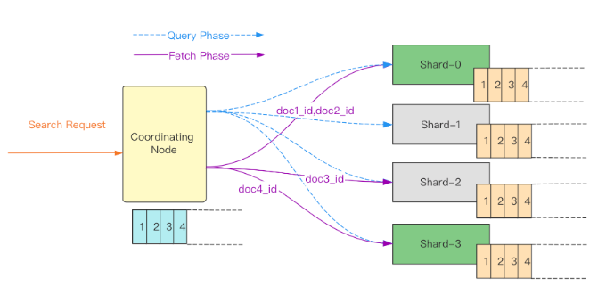
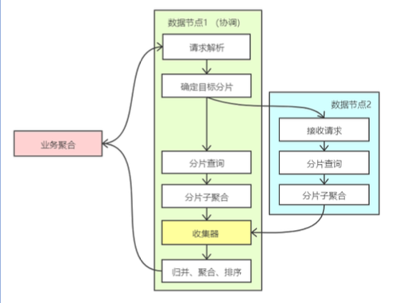
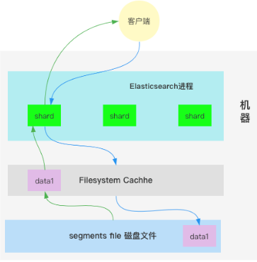
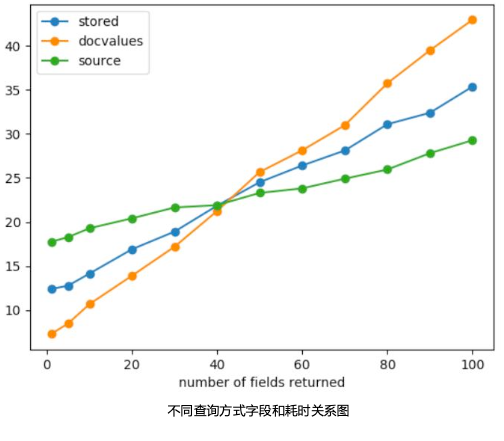

# ES搜索流程

## 查询基本流程
1、客户端发送检索请求到协调节点
2、协调节点将查询请求发送给索引中每一个分片（主副本分片轮询选其中一个）
3、分片在本地执行搜索并构建一个匹配文档的队列，并将该检索结果排序后的doc_id列表返回给协调节点
4、协调节点在本地构建一个全局排序后的doc_id队列，并取前from+size条doc_id，发送给对应的分片
5、对应分片再根据具体的doc_id值在本地查询到docment后将完整数据返回给协调阶段
6、协调阶段最终将查询结果返回给客户端

## 关键步骤拆解

- Query Phase  
    每个分片上查询到匹配的doc id。  

- Fetch Phase  
    根据查询到的doc id查询具体、完整的文档。


# 优化
## 1. 减少长文本模糊匹配，降低CPU 大量分词上的开销
长文本全文查询由于在查询时需要进行分词处理，因此在查询并发较大的情况下，
cpu会先于IO被打满，从而出现大量的查询拒绝。
某教育类大客户踩坑问题记录：https://cloud.tencent.com/developer/article/1837626

## 2. 使用SSD硬盘，读多写少场景

## 3. 设置多副本提高井发和均衡单节点压力
Search查询请求是从索引的主副本分片中随机选择一个分片进行查询，因此多个副本
可以充分利用多节点性能，避免 单节点压力过大导致整体性能下降。

## 4. 、频繁更新的索引要定期执行Forcemerge
降低查询时Segment文件的遍历
频繁更新的索引会产生大量的soft_deleted文档，既占用磁盘空间，还会消耗查询性能，建
议在低峰期定期执行ForceMerge。
```shell
执行forcemerage常用API：
POST /my-index/_forcemerge
POST /my-index/_forcemerge?max_number_segments=1
POST /my-index/_forcemerge?only_expunge_deletes=true
```

## 5. 利用缓存：不需要算分的查询使用 filter context 代替 query
query 关注的景此文档与查询子句的匹配相关度如何？
Flter 关注的是此文档与查询子句是否匹配，是否满足查询条件？〔不涉及算分］
https://www.elastic.co/guide/en/elasticsearch/reference/7.15/query-filter-context.html

## 6.、搜索排序场景在写入时对索引设置 Index Sorting数
默认情况下，Lucene 不会做任何排序操作，Search 请求必须检索与查询相匹配的所有文档，
然后返回按指定字段排序的 TopN 文档。
而通过 index.sort.* 设置可以对Segment内的特定字段进行排序，字段类型支持 boolean、
numeric、date 和 keyword(doc_values)。详情可参考官方文档。
https://www.elastic.co/guide/en/elasticsearch/reference/master/index-modules-index-sorting.html

```shell
PUT index_name
{
  "settings": {
    "index": {
       "sort.field": "timestamp",
       "sort.order": "desc"
    }
  },
 "mappings" {
  "properties": {
    "timestamp": {
      "type": "date"
    }
  }
}

GET /index_name/_search
{ 
  "size": 10,
  "sort": [
    { "timestamp". "desc" }
  ]
}

# E5会检查每个提前排好序的segment文件的topn条doc返回，而不再对shard上所有的segment文件进行遍历，大大降低查询耗时。
```
## 7.为文件系统缓存预留足够的内存空
ES的检索性能高度依赖底层的 Filesystem Cache，如果给 Filesystem Cache预留足够的内存，那么搜索时候将基本都是走内存，检索性能会非常高。建议机器的总内存容量至少可以容纳索引数据量的一半，并顾热Filesystem Cache，这样基本可以做到亿级文档毫秒级响应。详情可参考官方文档。

https://www.elastic.co/guide/en/elasticsearch/reference/master/preload-data-to-file-system-cache.html

1、静态配置elasticsearch.yml  
```shell
index.store.preload: ["nvd", "dvd"]
```

2、索引创建时设置setting
```shell
PUT /my-index-000001
{
"settings": {
  {
    "index.store.preload": ["nvd", "dvd"]
  }
}
```

## 8、自定义 routing写入和检索，减少分片查询范围
自定义 routing 查询，可以做到精准分片检索，减少索引分片的查询范围，提升查询性
能
容易踩坑的点：  
如果routing存在严重数据不均等情况，可能会出现严重的热点分片和查询超时问题。

临时解决：reindex。
长期解决：需要去除自定义routing并拆分索引。

```GET _tasks?pretty&detailed&actions=*read* | grep shardId | sort | uniq -c| sort -n```


## 9、docvalue_fields 替代 source，降低查询过程中解压及网络传输开销
- 从 source中 取数据，由于走的是行存，因此每次查询都会读取一行数据，从一行数据中过滤字段，
其中在解压、序列化等操作上有较多的性能开销
- 通过使用 docvalues_fileds 替代source，由于是直接从列存中取数据，可以大大降低检索过程中的
source 字段的解压缩及序列化开销。行存检索变列存检索 
- 通过将 stored_fileds 设置为 _none_，可以降低返回结果的流量消耗，提升查询性能

- docvalue_fields + stored_fileds 结合使用，可大幅度提升查询性能。
```shell
GET filebeat-7.2.1/_search
{
"from": 0,
"size": 5000,
"_source": f
"includes": [
"region", "host.name"
]
}
```
```shell
GET filebeat-7.2.1/_search
"from": 0,
"size": 5000,
"stored_fields": ["_ none_"],
"docvalue_fields": [
"region", "host.name"
]
}
```


不适用的场景：
需要取回的字段中包含如下情况：
1. text类型相关的字段
2. 嵌套类型的对象
3. 显示设置doc_value为false的字段 ［"doc_values"： false）

```json
{
  "reason": {
   "type": "illegal_argument_exception",
   "reason": "Can't load fielddata on [name] because fielddata is unsupported on fields of type [keyword]. Use doc values instead."
}}
```
性能测试结果分析：

基于8C 32C 规格，构建100w 条测试数据（每条数据包含100个字段〕不断变化查询字段数进行查询，得到如下结果：

1、当字段数很少时，低于40，使用 doc_value Fields 拉取，耗时最低，性能最优。
分析：如果我们只需要返回其中包含的一小部分字段时，读取并解压这个巨大的_5Ource字段可能会开销很高。

2、当字段超较多时，达到40以上时，使用_source耗时最低，查询性能最优。  

分析：当需要非常多、几乎全部字段时，此时使用 doc_value Fields 可能会有非常多的随机 
10。此时读取_source一个字段就能够包含几乎全部字段，耗时最低。 

3、在不同数据场景下，_source、列存、store 查询性能的平衡点可能会偏移，还是需要实际的压测。

# 指标监控
ES 集群一般由多个节点构成，为反映集群整体的运行情况，部分监控指标提供了两类值：平均值、最大值。所有指标的统计周期均为1分钟，即每1分钟对集
群的指标采集1次。具体各指标含义说明如下：

| **监控指标**           | **统计方式**                             | **详情**                                                                                                                                                                                                                                                                                                                                                                                                                                                                                                                                                                                                                                                                                                                                                                             |
|-------------------------|------------------------------------------|-------------------------------------------------------------------------------------------------------------------------------------------------------------------------------------------------------------------------------------------------------------------------------------------------------------------------------------------------------------------------------------------------------------------------------------------------------------------------------------------------------------------------------------------------------------------------------------------------------------------------------------------------------------------------------------------------------------------------------------------------------------------------------------|
| **集群健康状态**         | ES 集群健康状态：<br>0：绿色，正常<br>1：黄色，告警<br>2：红色，异常 | **green**：表示所有的主分片和副本分片都可用，集群处于最健康的状态。<br>**yellow**：表示所有的主分片均可用，但部分副本分片不可用。此时搜索结果仍然是完整的，但集群的高可用性在一定程度上受到影响，数据面临较高的丢失风险。在集群健康状态变为 yellow 后，应及时调查和定位问题，并修复，防止数据丢失。<br>**red**：表示至少一个主分片以及它的全部副本均不可用。集群处于 red 状态意味着已有部分数据丢失：搜索只能返回部分数据，而分配到丢失分片上的写入请求会返回异常。在集群健康状态变为 red 后，应及时定位异常分片，并进行修复。 |
| **平均磁盘使用率**       | 集群各个节点的磁盘使用率的平均值。       | 磁盘使用率过高会导致数据无法正常写入。解决方法：及时清理无用的索引，对集群进行扩容，增加单节点的磁盘容量或增加节点个数。                                                                                                                                                                                                                                                                                                                                                                                                                                                                                                                                                                                                                                 |
| **最大磁盘使用率**       | 集群各个节点中最大磁盘使用率。           | -                                                                                                                                                                                                                                                                                                                                                                                                                                                                                                                                                                                                                                                                                                                                                                                   |
| **平均 JVM 内存使用率**   | 每集群各个节点的 JVM 内存使用率的平均值。 | 该值过高会导致集群节点 GC 频繁，甚至出现 OOM。导致该值过高的原因，一般是节点上 ES 处理任务超出节点 JVM 的负载能力。您需要注意观察集群正在执行的任务，或调整集群的配置。                                                                                                                                                                                                                                                                                                                                                                                                                                                                                                                                                                           |
| **最大 JVM 内存使用率**   | 集群各个节点中最大 JVM 内存使用率。       | -                                                                                                                                                                                                                                                                                                                                                                                                                                                                                                                                                                                                                                                                                                                                                                                   |
| **平均 CPU 使用率**       | 集群各个节点的 CPU 使用率的平均值。       | 当集群各节点处理的读写任务超出节点 CPU 的负载能力时，该指标就会过高。CPU 使用率过高会导致集群节点处理能力下降，甚至宕机。<br>**解决方案**：<br>- 观察该指标是持续性较高，还是临时飙升。若是临时飙升，确定是否有临时性复杂任务正在执行。<br>- 若该指标持续较高，分析业务对集群的读写操作是否可以优化，降低读写频率，减小数据量，从而减轻节点负载。<br>- 对于节点配置无法满足业务吞吐量的情况，建议对集群节点进行纵向扩容，提高单节点的负载能力。                                                                                                                                                                                                                                                                                                                                       |
| **最大 CPU 使用率**       | 每单位统计周期内（1分钟），集群各个节点中最大 CPU 使用率。 | -                                                                                                                                                                                                                                                                                                                                                                                                                                                                                                                                                                                                                                                                                                                                                                                   |
| **集群1分钟平均负载**     | 集群1分钟所有节点的平均负载 load_1m。     | 指标来源：ES 节点状态 API：`_nodes/stats/os/cpu/load_average/1m`。<br>load_1m 过高时，建议降低集群负载或调大集群节点规格。                                                                                                                                                                                                                                                                                                                                                                                                                                                                                                                                                                                                                     |
| **集群1分钟最大负载**     | 集群1分钟所有节点的最大平均负载 load_1m。 | -                                                                                                                                                                                                                                                                                                                                                                                                                                                                                                                                                                                                                                                                                                                                                                                   |

## 部分指标含义及说明
| **监控指标**           | **统计方式**                                                                                                                                                                                                                                                                                                                                                                   | **详情**                                                                                                                                                                                                                                                                                                                                                                                                                                                                                                 |
|-------------------------|------------------------------------------------------------------------------------------------------------------------------------------------------------------------------------------------------------------------------------------------------------------------------------------------|--------------------------------------------------------------------------------------------------------------------------------------------------------------------------------------------------------------------------------------------------------------------------------------------------------------------------------------------------------------------------------------------------------------------------------------------------------------------------------------------------------|
| **平均写入延迟**         | 写入延迟（index_latency），指单次 index 请求耗时（ms/次），集群平均写入延迟是统计周期内（1分钟）所有节点单次 index 请求耗时的平均值。                                                                                                                                                                                                    | 节点单次 index 请求耗时计算规则：<br>每隔一个统计周期（1分钟）记录一次节点的两个指标：<br>- 节点历史 index 总次数 (`_nodes/stats/indices/indexing/index_total`)<br>- 节点历史 index 总耗时 (`_nodes/stats/indices/indexing/index_time_in_millis`)<br>取相邻两次记录的差值，即一个周期内的绝对值并进行计算：**index 耗时 / index 次数**，得出统计周期内（1分钟）单次 index 平均耗时。<br>写入延迟过高时，建议调大节点规格或增加节点个数。                                                                                                                                                                                            |
| **最大写入延迟**         | 写入延迟（index_latency），指单次 index 请求耗时（ms/次），集群最大写入延迟是统计周期内（1分钟）所有节点中单次 index 请求耗时的最大值。                                                                                                                                                                                                    | 节点单次 index 请求耗时计算规则：见 **平均写入延迟**。                                                                                                                                                                                                                                                                                                                                                                                                                                                                      |
| **平均查询延迟**         | 查询延迟（search_latency），指单次查询请求耗时（ms/次），集群平均查询延迟是统计周期内（1分钟）所有节点单次查询请求耗时的平均值。                                                                                                                                                                                                         | 节点单次查询请求耗时计算规则：<br>每隔一个统计周期（1分钟）记录一次节点的两个指标：<br>- 节点历史查询总次数 (`_nodes/stats/indices/search/query_total`)<br>- 节点历史查询总耗时 (`_nodes/stats/indices/search/query_time_in_millis`)<br>取相邻两次记录的差值，即一个周期内的绝对值并进行计算：**query 耗时 / query 次数**，得出统计周期内（1分钟）单次查询平均耗时。<br>查询延迟过高时，建议调大节点规格或增加节点个数。                                                                                                                                                                                                                    |
| **最大查询延迟**         | 查询延迟（search_latency），指单次查询请求耗时（ms/次），集群最大查询延迟是统计周期内（1分钟）所有节点中单次查询请求耗时的最大值。                                                                                                                                                                                                         | 节点单次查询请求耗时计算规则：见 **平均查询延迟**。                                                                                                                                                                                                                                                                                                                                                                                                                                                                           |
| **平均每秒写入次数**     | 集群所有节点接收到的每秒 index 请求次数的平均值。                                                                                                                                                                                                                                              | 节点每秒 index 请求次数计算规则：<br>每隔一个统计周期（1分钟）记录一次节点历史 index 总次数 (`_nodes/stats/indices/indexing/index_total`)，取相邻两次记录的差值，即一个周期内的绝对值并进行计算：**index 次数 / 60秒**，得出统计周期内每秒 index 请求次数的平均值。                                                                                                                                                                                                                                                                                                                          |
| **平均每秒完成查询次数** | 集群所有节点接收到的每秒查询请求次数的平均值。                                                                                                                                                                                                                                                  | 节点每秒查询请求次数计算规则：<br>每个统计周期（1分钟）记录一次节点历史查询总次数 (`_nodes/stats/indices/search/query_total`)，取相邻两次记录的差值，即一个周期内的绝对值并进行计算：**query 次数 / 60秒**，得到统计周期内每秒查询请求次数的平均值。                                                                                                                                                                                                                                                                                                                                             |
| **写入拒绝率**           | 单位周期内，集群写入请求被拒绝次数 ÷ 总写入请求次数，得到的比率。                                                                                                                                                                                                                              | 具体计算规则：<br>每隔一个统计周期采集两个指标：<br>- 历史写入请求被拒绝次数<br>&nbsp;&nbsp;* 5.6.4版本：`_nodes/stats/thread_pool/bulk/rejected`<br>&nbsp;&nbsp;* 6.4.3及之后版本：`_nodes/stats/thread_pool/write/rejected`<br>- 历史写入请求次数<br>&nbsp;&nbsp;* 5.6.4版本：`_nodes/stats/thread_pool/bulk/completed`<br>&nbsp;&nbsp;* 6.4.3及之后版本：`_nodes/stats/thread_pool/write/completed`<br>取相邻两次记录的差值，即一个周期内的绝对值并进行计算：**写入请求拒绝次数 / 写入请求完成次数**。<br>写入 QPS 过大，CPU、内存、磁盘使用率过高时，可能会造成集群写入拒绝率增加。<br>**解决方案**：<br>- 提高节点规格或降低写入操作次数。<br>- 扩容集群磁盘或删除无用数据。 |

## 
| **监控指标**                   | **统计方式**                                                                                                                                                                                                                                   | **详情**                                                                                                                                                                                                                                             |
|---------------------------------|--------------------------------------------------------------------------------------------------------------------------------------------------------------------------------------------------------------------------------|-----------------------------------------------------------------------------------------------------------------------------------------------------------------------------------------------------------------------------------------------------|
| **查询拒绝率**                  | 单位周期内，集群查询请求被拒绝次数 ÷ 总查询请求次数，得到的比率。<br>具体计算规则：<br>每隔一个统计周期采集两个指标：<br>- 历史查询请求被拒绝次数 (`_nodes/stats/thread_pool/search/rejected`)<br>- 历史查询请求次数 (`_nodes/stats/thread_pool/search/completed`)<br>取相邻两次记录的差值，计算公式：**查询请求拒绝次数 / 查询请求完成次数**。 | 写入 QPS 过大，CPU、内存使用率过高，可能会导致集群查询拒绝率上升。这通常表明集群当前配置无法满足业务读操作需求。<br>**解决方案**：建议调大集群节点配置，提高集群节点的处理能力。                                                                                         |
| **集群总文档数**                | 集群中的文档总数，此数字可能包括来自嵌套字段的文档。<br>**计算规则**：ES 集群文档数 API：`_cluster/stats/indices/docs/count`，详情请参见 Cluster stats API。                                                                                       | -                                                                                                                                                                                                                                                   |
| **自动快照备份状态**            | 集群开启自动快照备份后的备份结果：<br>- **0**：未开启自动备份<br>- **1**：自动备份正常<br>- **-1**：自动备份失败                                                                                                                                              | 自动快照备份会将集群数据定时备份到 COS，以便在需要时进行数据恢复，从而更全面保障数据安全。<br>**建议**：开启自动快照备份，更多信息可查看相关文档。                                                                                                     |
| **分片中最大文档数**            | 集群中全部索引下分片，按文档数统计后的单个分片最大值。                                                                                                                                                                                        | -                                                                                                                                                                                                                                                   |
| **集群最大分片存储量**          | 集群中全部索引分片，按存储量统计后的单个分片最大值。                                                                                                                                                                                        | -                                                                                                                                                                                                                                                   |
| **集群最大分片文档 delete 次数** | 集群中全部索引下分片文档数中，单个分片中被标记为已删除状态的文档数量经统计后，各个分片中的最大值。                                                                                                                                                        | -                                                                                                                                                                                                                                                   |
| **集群最大分片文档 delete 次数占比** | 集群中全部索引下分片文档数中，单个分片中被标记为已删除状态的文档数量相较于该分片文档总数的比值，各个分片下的比值中的最大值。                                                                                                                                           | -                                                                                                                                                                                                                                                   |
| **活跃查询 context 数量**        | 集群下全部节点统计活跃查询 context 的均值。                                                                                                                                                                                 | -                                                                                                                                                                                                                                                   |
| **查询任务耗时 90 分位**         | 每单位统计周期内，集群最大节点执行查询任务的 90 分位时延。                                                                                                                                                                        | -                                                                                                                                                                                                                                                   |
| **写入任务耗时 90 分位**         | 每单位统计周期内，集群最大节点执行写入任务的 90 分位时延。                                                                                                                                                                        | -                                                                                                                                                                                                                                                   |
