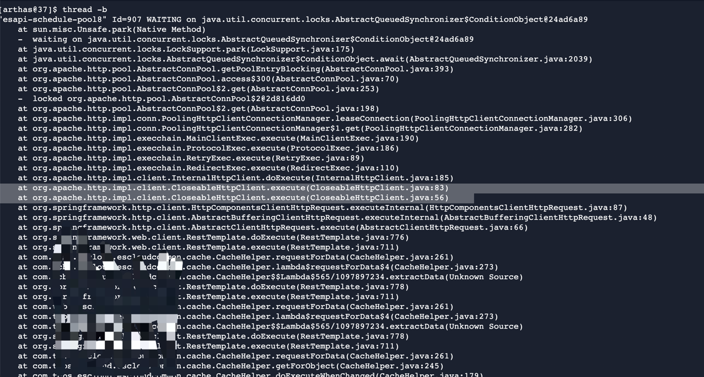
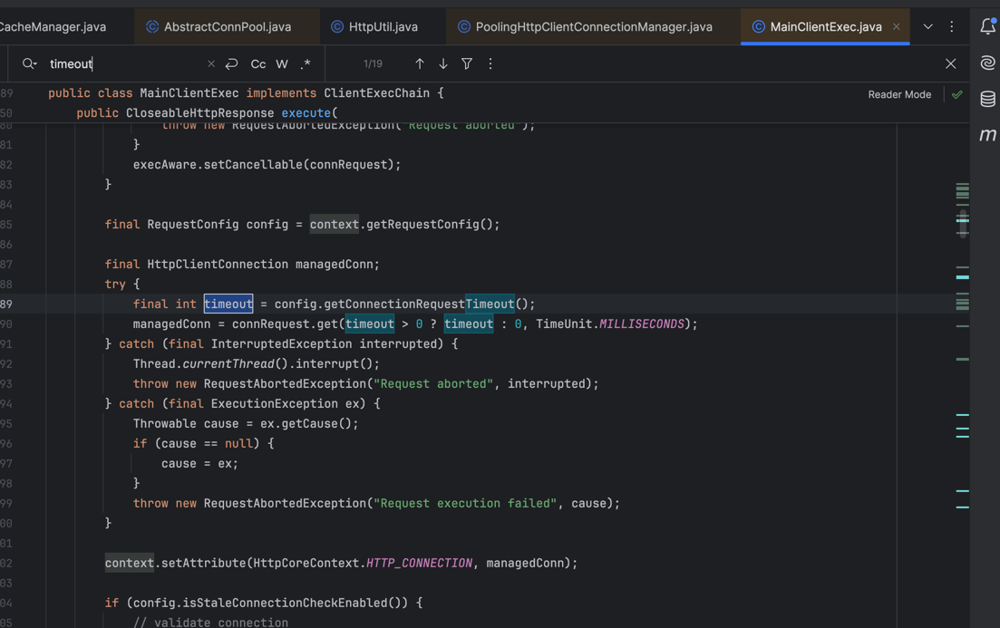
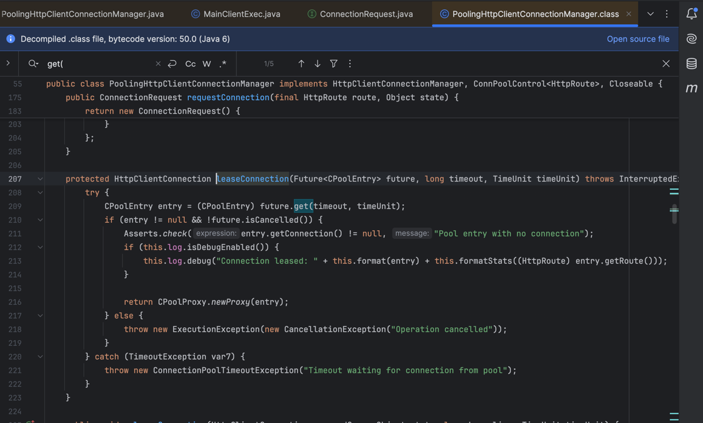
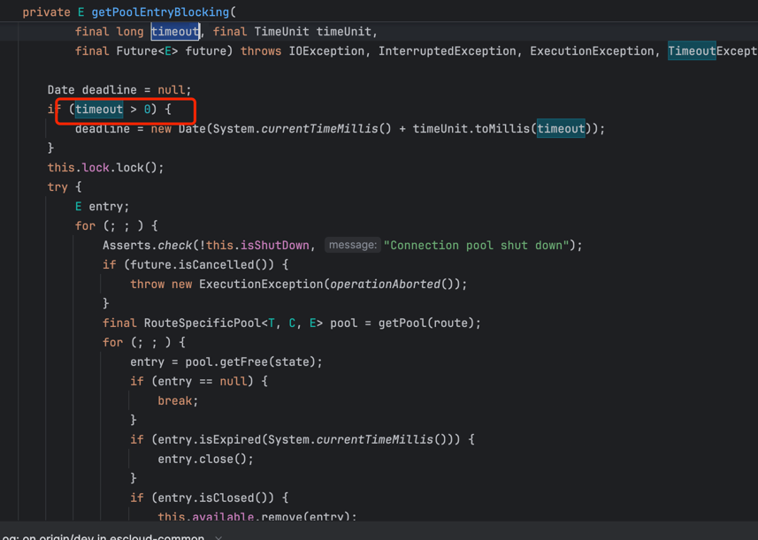
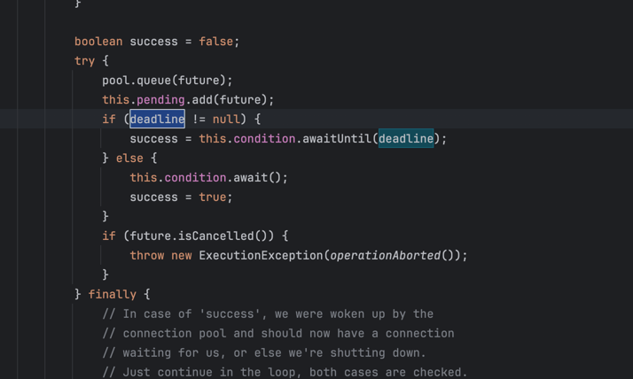

# RestTemplate参数设置的坑
## 现象
有一个服务的定时任务拉取阻塞住了


经过排查，由于有一个timeout参数未设置，导致客户端会在获取连接的时候一直等响应。





没有设置`setConnectionRequestTimeout`导致。

## 源码
```java
@Bean
    public RestTemplate restTemplate() {
        // 采用apache的
        HttpComponentsClientHttpRequestFactory requestFactory = new HttpComponentsClientHttpRequestFactory(HttpClients.createDefault());
        requestFactory.setConnectTimeout(3000); //3s
        requestFactory.setReadTimeout(20_000); //20s
        requestFactory.setConnectionRequestTimeout();
        return new RestTemplate(requestFactory);
    }
```

改造如下
```java
 @Bean
    public RestTemplate restTemplate() {
        PoolingHttpClientConnectionManager connectionManager = new PoolingHttpClientConnectionManager();
        connectionManager.setMaxTotal(100);
        connectionManager.setDefaultMaxPerRoute(20);

        RequestConfig requestConfig = RequestConfig.custom()
                .setConnectTimeout(5000)
                .setSocketTimeout(30000)
                .setConnectionRequestTimeout(5000)
                .build();

        CloseableHttpClient httpClient = HttpClients.custom()
                .setConnectionManager(connectionManager)
                .setDefaultRequestConfig(requestConfig)
                .build();

        HttpComponentsClientHttpRequestFactory requestFactory = new HttpComponentsClientHttpRequestFactory(httpClient);
        return new RestTemplate(requestFactory);
    }
```