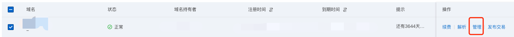
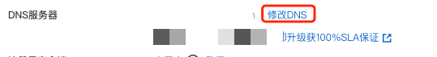
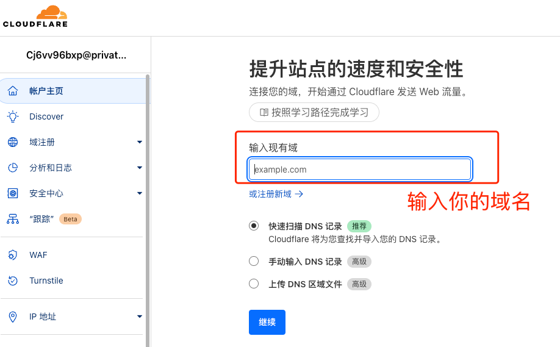
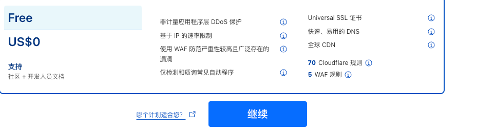
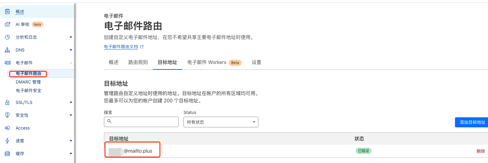

# 下载
https://www.cursor.com/cn

# 续杯
## 域名
1. 申请一个域名。  
买一个便宜的就行，比如5年或者10年。也就100来块。
https://wanwang.aliyun.com/domain/searchresult

2. 备案  
似乎申请.top结尾的不需要备案

3. 域名管理  
待会配置DNS有用。
https://dc.console.aliyun.com/next/index#/domain-list/all

  
修改DNS
```shell
may.ns.cloudflare.com
reese.ns.cloudflare.com
```


## cloudflare
1. 申请一个邮箱
2. 添加域，也就是你自己买的。

3. 选择free

4. 配置DNS，就是刚才阿里云管理那
https://dc.console.aliyun.com/next/index#/domain-list/all
5. 继续在cloudflare点下一步，配置完成
6. 设置电子邮箱路由。
可以用来接收你的电子邮件密码等，在cloudflare中配置就行。还有你的破解项目的配置文件。  
https://tempmail.plus/zh/#
6. 记得开启代理

## github
下载一个最新的release版本，解压
https://github.com/chengazhen/cursor-auto-free/releases

设置目标地址，相当于转发你到时候申请的账户信息，破解程序可以去里面拿，这样不需要登陆你的邮箱。  


### names-dataset文件
把该文件放在解压路径下

### env文件
在破解文件目录下创建 `.env` 文件

```touch .env```
- DOMAIN：然后填写你的临时邮箱地址
- TEMP_MAIL：临时邮箱，这个就从该网站`https://tempmail.plus/zh/#!` 中获取
- TEMP_MAIL_EXT：@mailto.plus
```shell
DOMAIN='youremail.top'
TEMP_MAIL='yourtmpemail@mailto.plus'
TEMP_MAIL_EXT=@mailto.plus
```

## 启动
进入破解文件目录
```shell
./CursorPro
```